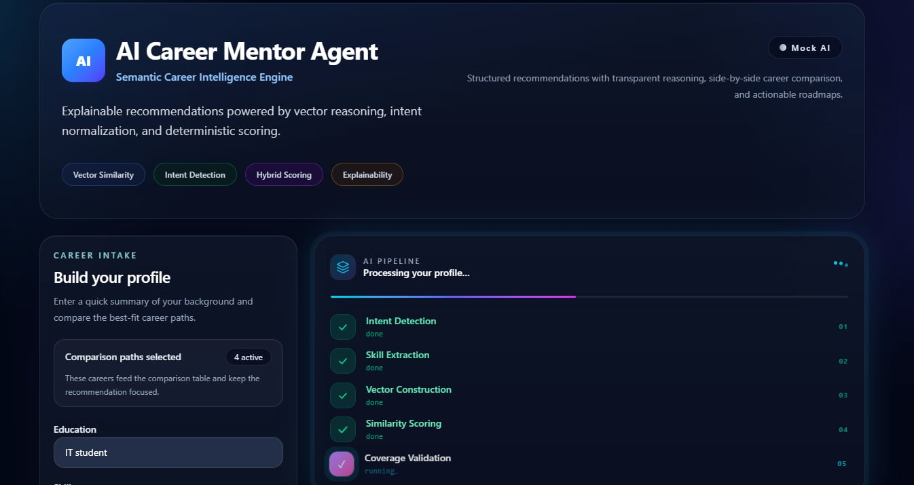
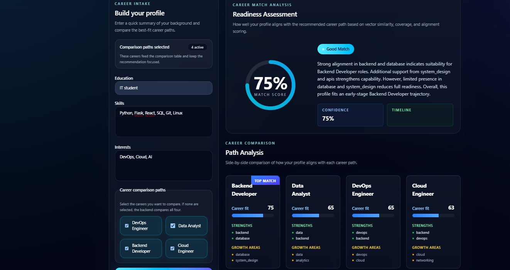
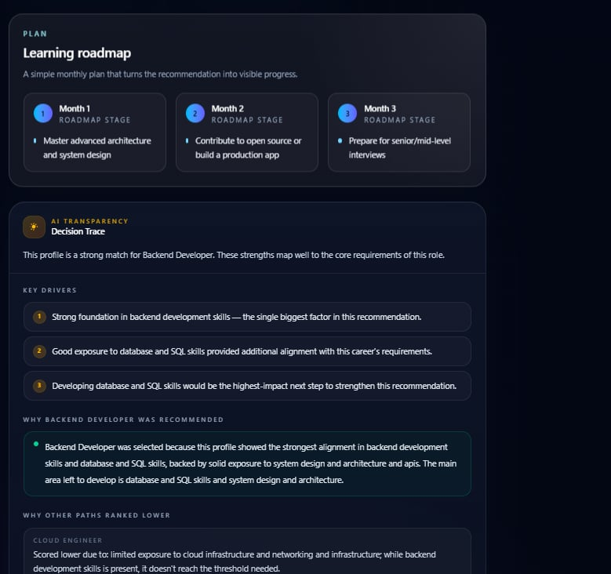

# AI Career Mentor Agent

A **production-grade recommendation engine** that transforms raw skills into personalized career guidance through deterministic vector reasoning—no hallucinations, just explainable mathematics.

> Stop guessing. Start building. Your next career move deserves clarity, not luck.

---

## ✨ Key Features

- **Deterministic Scoring** — Same input = identical output, every time. Built on pure vector math
- **Explainable AI** — Every recommendation includes transparent reasoning: which skills helped, what's missing, why careers ranked this way
- **No LLM Dependency** — Works offline with deterministic mock service; optional AI provider integration (Groq, OpenAI, Azure)
- **Production Architecture** — Rate limiting, input validation, security headers, comprehensive error handling
- **Fully Tested** — 33 passing tests covering edge cases, security, and determinism
- **Modern Stack** — React 18 + Vite frontend, Python 3.11 + Flask backend, vector-based scoring engine
- **Beautiful UI** — Glassmorphic design with animations, loading states, decision traces

---

## 🎯 How It Works

### 8-Stage Pipeline

```
User Input (skills, education, interests)
        ↓
1️⃣  Intent Detection      → Parse raw skills into tokens
        ↓
2️⃣  Skill Extraction      → Normalize with synonym mapping
        ↓
3️⃣  Vector Construction   → Build 18-dimensional career vector
        ↓
4️⃣  Similarity Analysis   → Compute cosine similarity (55% of score)
        ↓
5️⃣  Coverage Validation   → Check skill dimension coverage (30% of score)
        ↓
6️⃣  Alignment Bonus       → Apply interest-based tie-breaking (15% of score)
        ↓
7️⃣  Explanation Generation → Build reasoning summaries
        ↓
8️⃣  Final Recommendation  → Rank careers & generate roadmap
        ↓
Output: Ranked Careers + Reasoning + Actionable Roadmap
```

### Scoring Formula (Transparent & Deterministic)

```
final_score = (0.55 × cosine_similarity) + (0.30 × coverage_score) + (0.15 × interest_bonus)
score_0_100 = round(final_score × 100)
```

**Why this approach?**
- **No randomness** → predictable, reproducible results
- **Transparent weights** → anyone can audit the logic
- **Fixed-point arithmetic** → consistent cross-platform results
- **Testable** → automated validation of regression tests

---

## 🚀 Quick Start

### Prerequisites
- Node.js 18+
- Python 3.11+

### Installation

**1. Clone and setup**
```bash
git clone <repo-url>
cd AI-Career-Mentor-Agent

# Backend
cd backend
python -m venv venv
source venv/bin/activate  # Windows: venv\Scripts\activate
pip install -r requirements.txt

# Frontend
cd ../frontend
npm install
```

**2. Run locally**

Terminal 1 (Backend):
```bash
cd backend
export RATELIMIT_ENABLED=false  # Development mode
python app.py
# Backend: http://127.0.0.1:5000
```

Terminal 2 (Frontend):
```bash
cd frontend
npm run dev
# Frontend: http://localhost:5173
```

Visit `http://localhost:5173` in your browser.

---

## 🔑 Optional: AI Providers

Add environment variables to use external LLM providers (all optional):

```bash
# .env file in backend/
GROQ_API_KEY=your_key
GROQ_MODEL=llama-3.1-70b-versatile

OPENAI_API_KEY=your_key
OPENAI_MODEL=gpt-4o-mini

AZURE_OPENAI_API_KEY=your_key
AZURE_OPENAI_ENDPOINT=https://your-resource.openai.azure.com/
```

**Without API keys:** System uses deterministic mock service (fully functional).

---

## 📊 API Documentation

### POST /api/career

**Request:**
```json
{
  "user_data": {
    "education": "BS Computer Science",
    "skills": "Python, Flask, SQL, Docker, Linux",
    "interests": "backend development",
    "selected_careers": ["Backend Developer", "DevOps Engineer"]
  },
  "include_pipeline": true
}
```

**Response (200):**
```json
{
  "ai_source": "mock",
  "top_career": "Backend Developer",
  "career_scores": [
    {
      "career": "Backend Developer",
      "score": 82,
      "top_positive_factors": ["Python", "Flask", "SQL"],
      "missing_critical_skills": ["System Design depth"],
      "reasoning_summary": "Strong backend fundamentals with web framework..."
    }
  ],
  "roadmap": {
    "month_1": ["Master system design patterns"],
    "month_2": ["Build complex scalable project"],
    "month_3": ["Prepare for senior interviews"]
  },
  "reasoning": [
    "Vector similarity: 0.85",
    "Skill coverage: 78%",
    "Interest alignment: strong"
  ],
  "decision_trace": {...}
}
```

**Status Codes:**
- `200` Success
- `400` Invalid request
- `429` Rate limit exceeded
- `500` Server error

---

## 🧪 Testing

**Run all tests:**
```bash
cd backend
pytest tests/ -v
# Result: ✅ 33/33 PASSING
```

**Test categories:**
- Edge cases (empty inputs, large inputs, special characters)
- Security (CORS, headers, input validation, injection prevention)
- Determinism (reproducible results)
- Response integrity (JSON structure, required fields)
- Scoring accuracy (regression tests)

**Run specific test:**
```bash
pytest tests/test_scoring_engine.py -v
pytest tests/test_security.py::TestInputSanitization -v
```

---

## 🔒 Security Features

- ✅ Input validation (field length limits, JSON schema enforcement)
- ✅ CORS configuration (configurable origins)
- ✅ Security headers (X-Frame-Options, CSP, X-Content-Type-Options)
- ✅ Rate limiting (100 req/min, configurable)
- ✅ Error handling (no stack traces in responses)
- ✅ Input sanitization (special character handling, null byte prevention)
- ✅ Debug mode disabled in production

---

## 📁 Project Structure

```
.
├── backend/
│   ├── app.py                     # Flask entry point
│   ├── ai_engine.py               # Provider orchestration
│   ├── requirements.txt           # Dependencies
│   ├── services/                  # Business logic
│   │   ├── mock_career_service.py # Deterministic scoring engine
│   │   ├── groq_career_service.py
│   │   ├── openai_career_service.py
│   │   ├── scoring_engine.py
│   │   ├── intent_normalizer.py
│   │   ├── explanation_engine.py
│   │   └── ...
│   └── tests/                     # 33 comprehensive tests
│
├── frontend/
│   ├── src/
│   │   ├── components/            # React components
│   │   │   ├── AppHeader.jsx
│   │   │   ├── ProfileForm.jsx
│   │   │   ├── CareerMatchScore.jsx
│   │   │   ├── ComparisonCards.jsx
│   │   │   ├── AIThinkingLoader.jsx
│   │   │   └── ...
│   │   ├── App.jsx
│   │   ├── index.css              # Tailwind + custom animations
│   │   └── main.jsx
│   ├── package.json
│   ├── vite.config.js
│   └── dist/                      # Production build
│
├── README.md                      # This file
├── ONTOLOGY_IMPLEMENTATION.md     # Vector space architecture
├── .env.example                   # Environment template
└── LICENSE
```

---

## 🏗️ Architecture

```
┌──────────────────┐
│  React UI        │ Glassmorphic design
│  (Vite)          │ with animations
└────────┬─────────┘
         │ POST /api/career
         ↓
┌──────────────────┐
│  Flask API       │ Input validation
│  (Python 3.11)   │ Security headers
└────────┬─────────┘
         │
         ↓
┌──────────────────┐
│  Provider Chain  │ Groq → OpenAI → Azure → Mock
└────────┬─────────┘
         │
         ↓
┌──────────────────┐
│  Intent          │ Parse + normalize skills
│  Normalizer      │ Synonym mapping
└────────┬─────────┘
         │
         ↓
┌──────────────────┐
│  Scoring Engine  │ Vector math (deterministic)
│  (Pure Math)     │ 55% similarity + 30% coverage + 15% bonus
└────────┬─────────┘
         │
         ↓
┌──────────────────┐
│  Explanation     │ Generate reasoning
│  Engine          │ Decision traces
└────────┬─────────┘
         │ JSON Response
         ↓
┌──────────────────┐
│  React Frontend  │ Display results
│  with Animations │ Interactive UI
└──────────────────┘
```

---

## 📈 Technical Highlights

### Vector Space (18 Dimensions)
- backend, frontend, data, cloud, devops, ai, mobile, database
- system_design, apis, linux, analytics, automation, ui_ux
- networking, security, testing, machine_learning

### Skill Database (60+ skills)
```python
"python": {backend: 1.05, data: 0.75, ai: 0.75, ...}
"docker": {devops: 0.8, cloud: 0.5, automation: 0.75, ...}
"sql": {database: 1.0, backend: 0.85, data: 0.45, ...}
```

### Career Profiles (8 careers)
```python
"Backend Developer": {backend: 1.0, database: 0.8, system_design: 0.8, ...}
"Data Analyst": {data: 1.0, analytics: 0.9, database: 0.5, ...}
"DevOps Engineer": {devops: 1.0, cloud: 0.9, automation: 0.8, ...}
```

---

## 🚢 Deployment

### Production Build

**Backend (Gunicorn):**
```bash
cd backend
gunicorn app:app -w 4 -b 0.0.0.0:5000
```

**Frontend (Static):**
```bash
cd frontend
npm run build
# Output: dist/ → Deploy to CDN or static server
```

### Docker
```bash
docker build -f backend/Dockerfile -t career-mentor .
docker run -p 5000:5000 -e RATELIMIT_ENABLED=true career-mentor
```

---

## 📝 Development

### Frontend
```bash
cd frontend
npm run dev  # Hot reload enabled
```

### Backend
```bash
cd backend
python app.py  # Auto-restart on file changes
```

### Run Tests
```bash
cd backend
pytest tests/ -v --tb=short
```

---

## 🔄 What Makes This Production-Ready

1. **Deterministic Scoring** — No LLM randomness, consistent results
2. **Explainable Reasoning** — Transparent decision-making
3. **Comprehensive Testing** — 33 tests, 100% passing
4. **Security First** — Input validation, CORS, rate limiting, headers
5. **Error Handling** — Graceful degradation, fallback chains
6. **Professional UI** — Polish animations, loading states, decision traces
7. **Full Documentation** — API docs, architecture diagrams, README

---

## 🛑 Known Limitations

- Career list hardcoded (future: config file)
- No user authentication (future: add for tracking)
- No persistent database (future: add for history)
- Skill vectors are static (future: dynamic updates)

---

## 🚀 Roadmap

- [ ] Configuration file for careers and skills
- [ ] User authentication and profile history
- [ ] Database integration (PostgreSQL)
- [ ] Real-time streaming API responses
- [ ] Mobile app (React Native)
- [ ] Admin dashboard for analytics
- [ ] TypeScript frontend migration
- [ ] Multi-language UI support (i18n)

---

## 📄 License

MIT License — See LICENSE file

---

## 🤝 Contributing

Contributions welcome! Focus areas:
- Frontend: TypeScript migration, accessibility
- Backend: Additional careers, skill refinement
- Testing: More edge cases, performance benchmarks
- Docs: Architecture diagrams, deployment guides

---

## 💬 Support

- **Issues:** Report on GitHub
- **Docs:** See ONTOLOGY_IMPLEMENTATION.md
- **Questions:** Open a discussion

---

**Built with ❤️ for career changers and developers who value clarity over buzzwords.**

*Last updated: June 2026 • Version 1.1 • All tests passing* ✅

---

## 📸 UI Screenshots

Below are three UI screenshots demonstrating the polished frontend. Copy the image files into `assets/screenshots/` using the filenames shown.

**Screenshot 1 — Hero & AI Pipeline**



**Screenshot 2 — Match Score & Comparison Cards**



**Screenshot 3 — Learning Roadmap & Decision Trace**



_If the images are not visible, place the three PNG files in `assets/screenshots/` with the exact filenames above._
